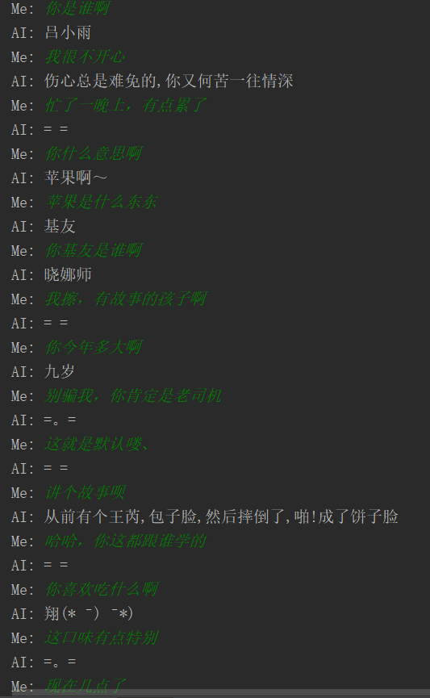
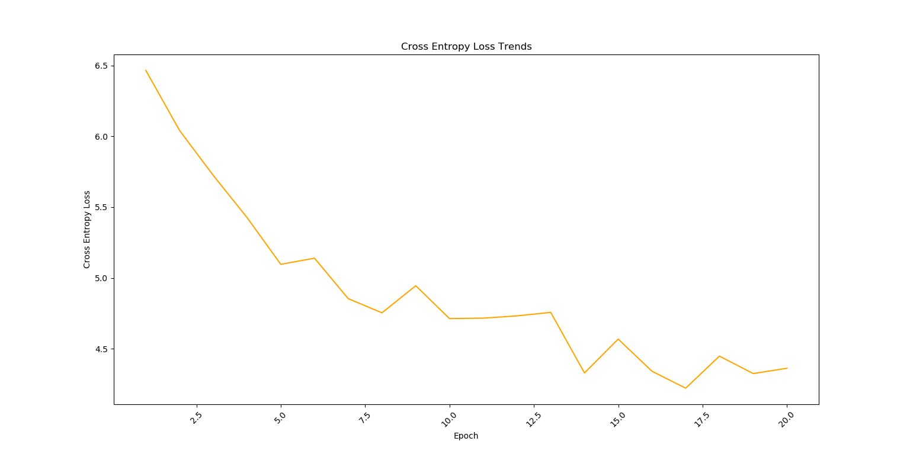
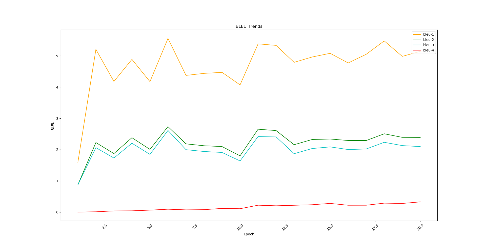
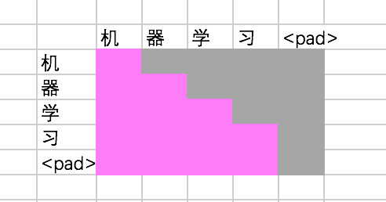
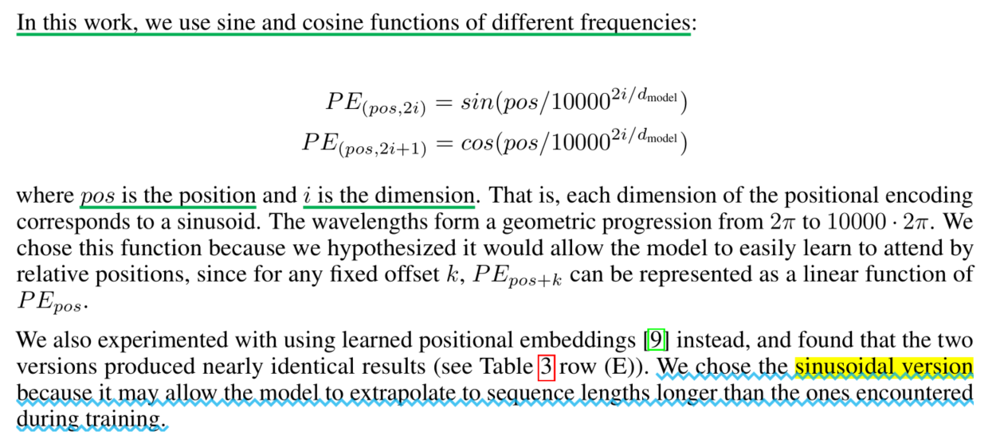
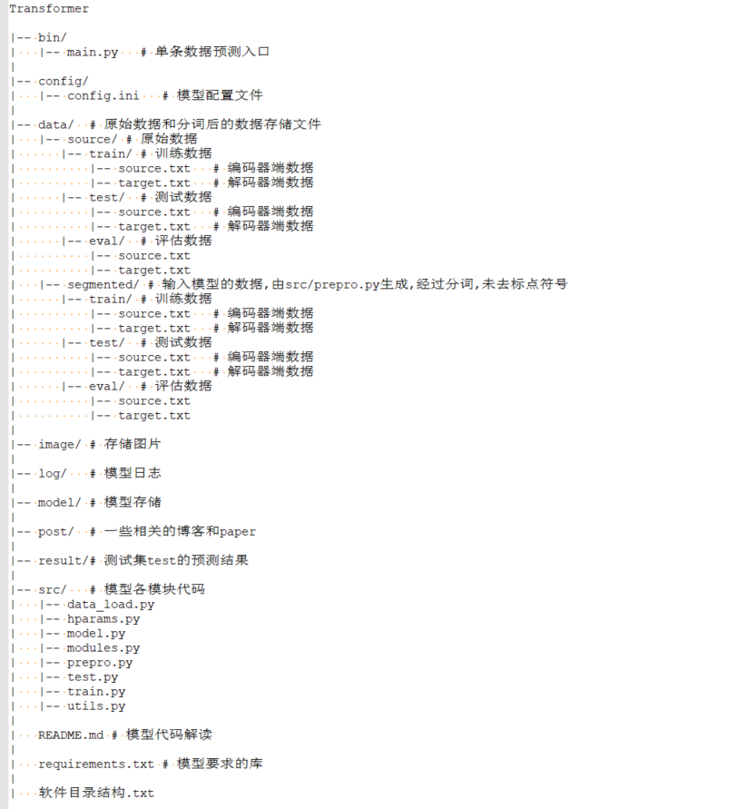

# 本项目来源
本项目学习于https://github.com/Kyubyong/transformer，为了自己以后方便使用，故对其进行了部分改写。

# 本项目用途

本项目基于小黄鸡语料，训练了一个端到端的闲聊机器人。

# 对话示例

# 模型训练损失

# 训练期间模型在评估集eval上的BLEU值变化曲线

# 本项目使用方式

我们已经训练好模型，读者首先应解压日志文件`log/log.zip`和模型文件`model/model.zip`，然后可以直接执行`bin/main.py`开启对话。如果想训练自己的聊天机器人，读者则需要认真阅读本教程后续内容。

# Transformer模型各模块学习：src文件夹

## 1. Hparams.py模块

本模块存储通过命令行获取的选项参数，以及其用途。我们对其进行了改写，默认参数从配置文件`./config/config.ini`中获取。参数大致分为三大部分：

### 第一部分：训练集，评估集和测试集的配置

训练集，评估集和测试集的source sequence和target sequence的输入路径

### 第二部分：模型参数的配置

1). 模型词包的路径

2). 编码器和解码器注意力层的维度

3). 前馈神经网络隐藏层的维度

4). 编码器端和解码器端各自堆叠的编码器和解码器的个数，默认是6个

5). 多头注意力的个数，默认是8个

6). 编码器端输入序列的最大长度

7). 解码器端输入和输出序列的最大长度

8). dropout比例

9). 对标签平滑的比率smoothing

10). 保存模型的个数

### 第三部分：训练后模型的存储路径，模型预测结果以及日志路径

1). 模型checkpoint存储路径

2). 模型日志的存储路径

3). 评估集预测结果存储路径

4). 测试集预测结果存储路径

## 2. prepro.py模块

本模块是模型运行的第一步，用于预处理数据，训练分词器和生成词包，并将源序列进行分词，以及做一些简单的描述统计，比如source sequence和target sequence的最大长度，最小长度以及平均长度。

模块首先读取原始数据(`raw data`)，然后对其进行分词，之后存储。**值得我们注意的是，这里并没有对原始数据去除标点符号，我们保留了。由于是将编码器和解码器端的数据放在一起训练分词器的，因此编码器端和解码器端的词包存储在同一个词包文件中，后续是用同一套单词ID编码的**。

在对原始数据(`raw data`)分词时，有两种选择，控制参数是配置文件[params]中的`if_train_tokenizer`，如果等于1表示训练分词器，为0表示用结巴分词：

### 1) sentencepiece分词

[`sentencepiece`](https://github.com/google/sentencepiece/blob/master/python/README.md)是Google开源的自然语言处理包，面向神经网络文本生成系统的无监督文本词条化工具，可以根据输入数据训练分词器，然后分词，这对于数据充沛的项目训练个性化的分词器尤其有用。 它会生成两个文件： **分词器model和词包**

我们主要用到了如下几个方法：

`import sentencepiece as spm`

#### 1. 训练和保存分词器: `spm.SentencePieceTrainer.Train(train)`

**train** =

	' --input=path1 --pad_id=0 --unk_id=1 --bos_id=2 --eos_id=3 --vocab_size=number --model_prefix=path2 model_type=bpe'

其中：

	1. --input: 后接待分词数据的存储路径，可以是多个文件，只需要将其路径用逗号分隔即可
	2. --pad_id=0: 填充符<pad>在分词器中的id，其具体表现是，会出现在生成的词包中第一行，并用<pad>表示。
	               注意<pad>是`sentencepiece`保留的特殊符号。
	3. --unk_id=1: 未知单词符号<unk>在分词器中的id，其具体表现是，会出现在生成的词包中第二行，并用<unk>表示。
	               注意<unk>是`sentencepiece`保留的特殊符号。
	4. --bos_id=2: 解码器端输入序列的第一个符号在分词器中的id，表示开始解码，其具体表现是，会出现在生成的词包中第三行，并用<s>表示。
	               注意<s>是`sentencepiece`保留的特殊符号。
	5. --eos_id=3: 编码器端输入序列的截止符和解码器端输入序列的截止符，以及解码器停止解码的标记符在分词器中的id，
	               其具体表现是，会出现在生成的词包中第四行，并用</s>表示。注意</s>是`sentencepiece`保留的特殊符号。
	6. model_prefix: 分词器模型的存储路径以及其名称前缀，生成的分词器只需在后边加上 .model 即可。
	7. model_type: 训练分词用的算法类型，这里用 bpe算法。
	8. vocab_size: 生成的词包大小，注意这里词包大小设置一定要适当，容易由于词包设置的过小导致分词器错误。

#### 2. 创建分词器对象: `sp = spm.SentencePieceProcessor()`

#### 3. 加载训练后分词器对象: `sp.Load(tokenizer_path)`

#### 4. 开始分词: `wordlst = sp.EncodeAsPieces(sent)`

注意分词结果中，空格会被'▁'替换，即如果字符前有空格，该字符会变为▁char 。

### 2) jieba分词

结巴分词不需要预训练分词器，但是我们需要自己生成词包，同时需要注意将`<pad>,<unk>,<s>,</s>`这四个特殊符号加到词包最前端。同时设置配置文件`config.ini` `[params] if_train_tokenizer=0`使用结巴分词。

## 3. data_load.py模块

该模块主要存储一些加载数据的功能函数，在该模块，带有`1`的名字表示是source端，即编码器端；带有`2`的表示target端，即解码器端。

source端和target端的序列会根据各自的长度被过滤掉，依据是长度+1大于预先设定的maxlen则会丢弃。因此如果要计算BLEU或者ROUGE，则需要注意模型生成的结果个数是否与对照的目标序列数量相等，以及是否对照！

原代码中并有考虑这个问题！为了解决这个问题，我们可以在`prepro.py`模块在分词时，提前过滤，缺点是当想调整source和target序列maxlen大小时，需要重新训练分词器和分词。因此，我们将这一步放到`train.py`和`test.py`模块中，这样每次训练和测试时，都会生成指定maxlen范围内的target序列，使得模型生成的序列与其对应，不会出现错位！

### 1. def load\_vocab(vocab_fpath)

vocab_fpath是词包的路径，该函数返回id2token,token2id的映射词典

### 2. def load\_data(fpath1,fpath2,maxlen1,maxlen2)

该函数返回经过各自maxlen过滤的source sequence列表，target sequence 列表。

	1. fpath1是编码器端输入序列的路径，注意经过分词了
	2. fpath2是解码器端输入和输出序列的路径，同样也经过了分词
	3. maxlen1是编码器端输入序列，我们设置的最大长度
	4. maxlen2是解码器端输入和输出序列，我们设置的最大长度

### 3. def encode(inp,type,dict)

该函数主要做三件事，第一是将输入的inp 单词字符串序列，用utf-8解码成元素为string的单词序列，并用split分割单词；第二是根据type的类型，对source端的inp在其单词数组末尾加上终止符`</s>`；对target端的inp在其单词列表头部加上起始符`<s>`，在其末尾加上终止符`</s>`；第三是将单词数组，依据dict转为id列表。如果发现不在词包的单词，则用`<unk>`的`id`替代。

	1. inp: 单词字符串序列，单词以空格分隔
	2. type: 可选值 x和y ，x表示inp是source端，y表示inp是target端
	3. dict: 是token2id字典，即单词到ID的映射词典

该函数返回单词ID列表。

注意，如果是编码器，则返回输入的形式为`source sequence + </s>`;如果是解码器，则返回输入的形式为`<s> + target sequence + </s>`，该形式在`generator_fn()`中会进一步切分为解码器端输入，和解码器端输出的对照序列。

### 4. def generator\_fn(sents1,sents2,vocab_fpath)

该函数采用生成器，循环生成训练数据或评估数据。

	1. sents1: 编码器端输入的句子列表，其中每个元素都是一个句子，每个句子又以单词序列的形式存在，单词序列是一个字符串，其中单词以空格分隔
	2. sents2: 解码器端的句子列表，其中每个元素都是一个句子，每个句子又以单词序列的形式存在，单词序列是一个字符串，其中单词以空格分隔
	3. vocab_fpath: 词包路径，用于生成token2id映射词典

该函数返回：

	1. (source端输入的单词ID列表，当前单词ID列表的长度,原始source端单词序列)
	2. (target端输入的单词ID列表，target端输出的单词ID列表，target端输出的当前单词ID列表的长度，原始target端单词序列)

注意解码器端输入的形式是`<s> + target sequence`，解码器端输出的对照序列是`target + </s>`

### 5. def input_fn(sents1,sents2,vocab\_fpath,batch\_size,shuffle=False)

该函数用于构造`tf.data.Dataset`数据集

	1. sents1: 编码器端输入的句子列表，其中每个元素都是一个句子，每个句子又以单词序列的形式存在，单词序列是一个字符串，其中单词以空格分隔
	2. sents2: 解码器端的句子列表，其中每个元素都是一个句子，每个句子又以单词序列的形式存在，单词序列是一个字符串，其中单词以空格分隔
	3. vocab_fpath: 词包路径，用于生成token2id映射词典
	4. batch_size: 批处理的数据大小
	5. shuffle: 是否对每batch_size的数据混洗

对于shapes，types和paddings的说明:

	1. 由于Dataset是由tf.data.Dataset.from_generator(generator_fn,...) 返回的，
	   因此shapes和types的形状和类型，既要符合函数generator_fn()的返回类型和尺寸，也要符合TensorFlow中张量的类型和形状。
	2. shapes： (([None],(),()),([None],[None],(),()))：第一个元组的含义是(source端输入的单词ID列表，
	   当前单词ID列表的长度,原始source端单词序列)，由于列表是一维的，故用[None]，其余两个都是0阶的标量，故用()表示；
       第二个元组的含义是(target端输入的单词ID列表，target端输出的单词ID列表，target端输出的当前单词ID列表的长度，原始target端单词序列)，含义同上。
	3. types： ((tf.int32,tf.int32,tf.string),(tf.int32,tf.int32,tf.int32,tf.string)) 表示各个维度的数据类型，解释如上。
	4. paddings: 各个维度的填充符，对于ID则是用<pad>对应的ID填充，长度用0填充，表示长度为0，字符串位置用空字符填充。

该函数返回tf.data.Dataset数据集。

### 6. def get\_batch(fpath1,fpath2,maxlen1,maxlen2,vocab_fpath,batch\_size,shuffle=False)

该函数用于生成灌入TensorFlow中的数据，是data_load.py模块的入口函数，由它调用上面所有的函数。因此参数在上面都已经解释过了。

该函数返回：

	1. batches：数据集，形式为tf.data.Dataset
	2. num_batches: 当前batches数据集依据batch_size有多少个batch
	3. len(sents1): 解码器端target序列的个数

## 4. utils.py模块

该模块主要存储一些对数据格式化，保存参数，加载参数和统计指标的功能性函数，比如计算BLEU指标，计算batch的个数，保存参数等。

### 1. def calc\_num\_batches(total\_num,batch\_size)

该函数用于计算tf.data.Dataset数据集中batch的个数，用于在训练时决定循环训练的次数。

	1. total_num: tf.data.Dataset数据集中数据的个数
	2. batch_size: 每batch数据的个数

该函数返回batch的个数，我们用number表示。

由于我们训练时，是每batch每batch迭代的，因此总共需要循环训练的次数为: num\_epoches * number，其中num\_epoches是迭代的次数。tf.data.Dataset之所以可以循环num\_epoches次，是由于我们在`data_load.py`的`input_fn()`函数中，设置tf.data.Dataset.repeat()无限循环下去了。

### 2. def convert\_idx\_to\_token\_tensor(inputs,idx2token)

该函数用于将模型预测的ID序列转为单词序列

	1. inputs: 一维的ID列表，元素为tf.int32
	2. idx2token: ID到单词的映射词典

该函数返回一维的单词序列，即一个字符串张量，例如['word word word']

### 3. def postprocess(hypotheses,idx2token)

该函数用于将模型预测出来的单词序列进行格式化，即获取截止符`</s>`前面的单词序列，丢掉其后的单词序列，并且将单词中的`▁`用空格替换。

这里有两点需要说明：

	1. 获取截止符</s>前面的单词序列，用它表示模型的输出。
	   模型控制解码长度的流程如下：首先，设置一个用于控制解码次数的值，代码中是在model.py模块里的eval()中设置，
       其值为解码器端的maxlen，即hp.maxlen_target；然后再截取截止符</s>前面的内容为输出，这部分工作是在本函数中完成的。 
	2. 如果用sentencepiece分词，空格会被▁替换，因此在输出结果时，我们需要重新将▁替换为空格。

该函数的参数含义如下：

	1. hypotheses: 解码器输出的ID序列构成的列表
	2. idx2token: ID到单词的映射词典
	
该函数返回，解码器端输出的单词序列字符串构成的列表。

### 4. def save\_hparams(hparams,path)

该函数用于在训练时保存模型超参数，即hparams.py模块中的参数。

	1. hparams: 是待保存的argsparse对象
	2. path: 保存路径

之所以要保存模型参数，是由于用户可以通过命令行将自定义的参数传给`hparams.py`模块，`hparams.py`模块如果重新加载，则只是保存了配置文件中的默认参数。该函数会将模型参数以json的形式保存到本地。具体而言，超参数保存在`./model/hparams`文件中。

### 5. def load_hparams(parser,path)

该函数用于在预测时，重新加载训练期间的模型超参数。

	1. hparams: 是argsparse对象，是用本地模型参数去覆盖的对象
	2. path: 参数被保存的路径

### 6. def save_variable\_specs(fpath)

该函数用于保存模型中变量的名字，形状，总量。

	1. fpath: 变量保存的路径

具体而言，模型中的变量及其名字，形状信息保存在`./model/specs`文件中。

### 7. def get\_hypotheses(num\_batches,num_samples,sess,tensor,refs,dict)

该函数用于对输入的tensor进行解码。

	1. num_batches: batch的个数
	2. num_samples: 所有batch中样本数据的总数
	3. sess: TensorFlow会话对象
	4. tensor: 所有batch的样本数据构成的tf.data.Dataset，是一个batch一个batch迭代的
	5. refs: 所有batch的样本数据target端解码参照序列构成的tf.data.Dataset,是一个batch一个batch迭代的
	6. dict: idx2token，ID到单词的映射词典

该函数返回，解码器端输出的单词序列字符串构成的列表和解码器端参照序列构成的列表，两者结构相同。

### 8. def calc_bleu(ref,translation,name,epoch)

该函数用于计算BLEU值，此处调用了nltk库的sentence_bleu来计算。

	1. ref: 参考序列对应的文件路径
	2. translation: 模型生成的序列对应的文件路径
	3. name: 用于分辨是测试数据还是评估数据
	4. epoch:迭代的步数

该函数会打印出BLEU值。

## 5. modules.py模块

该模块主要存储一些用于构建transformer模型的组件函数。

### 1. def ln(inputs,epsilon=1e-8,scope='ln')

该函数是`Encoder`和`Decoder`中的`layer_normalization`层，是对`self-attention`层和`feedforward`层后的残差连接结构(`Residual connection`)进行`normalization`的实现。残差连接的结构会使得网络对当前值求偏导时，多了一个常数项，故而在反向传播过程中，梯度连乘后，不会造成梯度消失。残差连接结构的具体实现在本模块的`multihead_attention()`中。

	1. inputs: 输入的多维tensor，在模型代码中是经过残差连接的输入
	2. epsilon: 一个极小的正数，用于在标准化(normalization)过程中避免除0的情况出现
	3. scope: 变量的作用域

该函数还定义了`beta`和`gamma`两个可学习的变量，可对`inputs`进行`BN`处理，如下图所示：

注意该函数只实现了图中的`LayerNorm()`操作，至于`Add(X+Z)`操作的实现是在`multihead_attention()`中。

函数返回和`inputs`相同形状的经过`BN`处理的`tensor`。

### 2. def get\_token_embeddings(vocab\_size,num\_units,zero\_pad=True)

该函数用于获取依据词包大小生成的词向量矩阵，即`Embedding matrix`。它是词包中所有词，依据其在词包中的顺序，一行一行排列的词向量构成的矩阵，它用于后续获取单词ID序列对应的词向量序列的查表。

	1. vocab_size: 词包大小
	2. num_units： 词向量的维度
	3. zero_pad: 是否在embedding matrix索引为0处，即第一行，填充上全0。

这里我们解释一下`zero_pad`参数的用途：

	1. zero_pad=True: 是将索引为0的单词的词向量全部置为0，即<pad>的词向量置为0。
	   我们词包中的第一个词是<pad>，它用于填充序列到指定长度，因此它是无意义的，故而其对应的词向量必须全0，这样不会携带任何信息。
       然而，我们的词向量矩阵在训练时是不断优化学习的，其值在不断改变，因此必须每次在查表时，都要将<pad>对应的词向量重置为0。

函数返回用于查表的词向量矩阵。

### 3. def scaled\_dot\_product\_attention
                      (Q,K,V,
                       causality=False,
                       dropout_rate=0.,
                       training=True,
                       scope='scaled_dot_product_attention')

该函数实现了`self_Attention`子层的计算，如下图所示：

首先我们先解释一下参数的形状中各个字母的含义：

	1. N：指代batch_size
	2. T：指代max of words in a sentence,即max_time_step
	3. d：指代Queries矩阵，Keys矩阵，Values矩阵的最后一维的大小，即每一个query，key，value向量的维度大小

该函数各个参数的含义：

	1. Q：形状是[N,T_q,d_k],是由self_Attention层的输入生成的查询矩阵
	2. K：形状是[N,T_k,d_k],是由self_Attention层的输入生成的键矩阵
	3. V：形状是[N,T_k,d_v],是由self_Attention层的输入生成的值矩阵
	4. causality：在encoder的self_attention子层中始终是False；
	   在decoder的Self_Attention子层中为True,在其Encoder-Decoder Attention子层中则为False
	5. dropout_rate: 一个浮点数，dropout操作的比例
	6. training: 一个布尔值，预测时为True，表明进行dropout操作；预测时为False，表明不进行dropout操作。
	7. scope：变量作用域

参数`causality`的用途是，在计算`Softmax Score`时，是否忽略后面时间步的`Score`,因为在解码时，我们是看不到当前时间步后面时刻的内容的，因此要`mask`掉,故取True。而Encoder-Decoder Attention子层中之所以是False，是由于其key,value都来自编码器的输出，该层的目的是计算当前解码时刻与编码器各个时刻的相关度。

该函数返回`Z`向量。

该函数执行过程如下：

	1. 计算Q*K的值，在计算前需要将两个矩阵的维度转置为满足矩阵乘法的形式，结果形状是[N,T_q,T_k],
	   它表明，每一个查询向量query，都有T_K个score值
	2. 将上一步的值进行缩放，即除以query，value向量的维度大小的算术平方根，输出为outputs
	3. 将上一步的输出outputs，进行key_mask,即将key向量中由于初始化的缘故，units全0的某个key，
	   在Q*K运算后对应的score值，从0重置为一个极小的值，使得这些key对应的attention score 权重很小但又不对结果造成影响，
       同时使得当前向量能够对`Z`注意力向量的计算有所贡献
	4. 如果causality为True，则进行future_mask，忽略当前时刻后面的score值
	5. 对上一步的输出进行softmax运算
	6. 对上一步的结果进行query_mask，即将query向量中由于初始化的缘故，units全0的某个query，即<pad>对应的query
	   在Q*K运算后对应的score值，我们将query全0的score，保持为0，其它不变，这样使得当前向量能够对`Z`注意力向量的计算没有任何贡献。
       因为<pad>不应该携带任何信息。
	7. 如果是训练，则对上一步的结果进行dropout
	8. 计算Z向量矩阵，即将上一步输出outputs*V
	9. 返回计算后的Z向量矩阵

mask操作之所以要进行key_mask和query_mask两次，是对应score为0的两种情况而言的，当然score为0的情况很多，不止这两种，但是我们只会对这两种情况进行处理，这也是为何不对score直接处理的缘由。其具体含义，请看下面。

### 4. def mask(inputs,queries=None,keys=None,type=None)

该函数的功能分为两部分：

	1. type='keys'或type='queries'时，将self_Attention中Q*K后，score为0的值重置为一个极小的值或保留其值不变,
	   以使得各个时刻都能够对当前`Z`注意力向量的计算有所贡献。
	2. type='future'时，将当前时间步后面的信息遮蔽住，即将后面时刻的score重置为一个极小的值。
	   之所以当前时间步后面会有信息，是因为在训练时，解码器端各个时刻的输入是同时灌进解码器的。
       实际上，该操作在预测时，并不起作用，因为预测时，当前时间步后面是没有任何信息的。

mask操作之所以要进行key\_mask和query\_mask两次，是对应score为0的两种情况而言的，当然score为0的情况很多，不止如下这两种，但是我们只会对这两种情况进行处理，这也是为何不对score直接处理的缘由：

	1. 将key向量中由于优化或初始化的缘故，units全0的某个key，在Q*K运算后对应的score值，
	   从0重置为一个极小的值，使得这些key对应的attention score 权重很小但又不对结果造成影响，
       同时使得当前向量能够对`Z`注意力向量的计算有所贡献

	2. <pad>对应的query向量，其初始units全0，在经过Q*K运算和softmax后对应的score权重值,应该为0。
	   此处与key的处理方式不同，不是将其重置为一个极小值，而是让它保留0权重值不变。
       原因在于，query为0，表示当前位置是<pad>，这是由于<pad>对应的词向量为0。同时当前位置不应该携带任何信息。
       我们需要通过mask操作，将那些query为0的score权重值重置为0。

该函数的参数含义如下：

	1. inputs: 维度是[N,T_q,T_k]
	2. queries: 维度是[N,T_q,d],查询向量矩阵
	3. keys: 维度是[N,T_k,d]，键向量矩阵

该函数运行过程如下：

#### [1]. type = 'key'

	1. masks = tf.sign(tf.reduce_sum(tf.abs(keys), axis=-1))
	   先通过tf.abs(keys)将每条key向量各个维度的值取绝对值，
       然后通过函数tf.reduce_sum(axis=-1)，将每条key向量各个维度的值累加，
       这会使得keys的形状，从[N, T_k, d]变为[N, T_k]，而在T_k维度的值要么是0，要么是正数;
       最后通过符号函数tf.sign()，将T_k维度的值变为0或1
    2. masks = tf.expand_dims(masks, 1) # (N, 1, T_k)
       将上一步的结果，在第1维度处增加一个维度
    3. masks = tf.tile(masks, [1, tf.shape(queries)[1], 1]) # (N, T_q, T_k)
       将上一步的结果，依据[1, tf.shape(queries)[1], 1]在各维度处复制相同的次数，
       即在0维度处复制1次，在1维度处复制tf.shape(queries)[1]次，在2维度处复制1次，
       因此最后masks的维度变为(N, T_q, T_k)
    4. paddings = tf.ones_like(inputs) * padding_num
       获取一个形状如inputs的，其值为padding_num的tensor
    5. outputs = tf.where(tf.equal(masks, 0), paddings, inputs)
       比较masks处每一个单元的值，如果是0，则填充上paddings在该位置处的值，否则仍保留inputs的值      

#### [2]. type = 'query'

	1. masks = tf.sign(tf.reduce_sum(tf.abs(queries), axis=-1))
	   先通过tf.abs(queries)将每条query向量各个维度的值取绝对值，
       然后通过函数tf.reduce_sum(axis=-1)，将每条query向量各个维度的值累加，
       这会使得queries的形状，从[N, T_q, d]变为[N, T_q]，而在T_q维度的值要么是0，要么是正数;
       最后通过符号函数tf.sign()，将T_q维度的值变为0或1
    2. masks = tf.expand_dims(masks, -1) # (N, T_q,1)
       将上一步的结果，在最后一个维度处增加一个维度
    3. masks = tf.tile(masks, [1, 1,tf.shape(keys)[1]]) # (N, T_q, T_k)
       将上一步的结果，依据[1, 1,tf.shape(keys)[1]]在各维度处复制相同的次数，
       即在0维度处复制1次，在1维度处复制1次，在2维度处复制tf.shape(keys)[1]次
       因此最后masks的维度变为(N, T_q, T_k)
    4. outputs = inputs*masks
       将masks与inputs相乘，由于masks的值要么为0，要么为1，因此会使得inputs相应的值要么保持不变，要么重置为0

#### [3]. type = 'future'

	1. diag_vals = tf.ones_like(inputs[0, :, :])  # (T_q, T_k)
	   创建一个形状是(T_q, T_k)，其值为1的tensor
    2. tril = tf.linalg.LinearOperatorLowerTriangular(diag_vals).to_dense()  # (T_q, T_k)
       将上一步的矩阵转为三角阵tril。三角阵中，对于每一个T_q,凡是那些大于它角标的T_k值全都为0，
       这样做，mask就可以让query向量只取当前时间步以及之前的key向量，因为其它时刻的key向量被置为一个很小的值了，
       计算而出的score也只有当前时间步及其之前的score。
       该操作应用于训练期间的解码时刻，在预测时，其实不起作用，因为预测时，其后面时刻的信息是不存在的。
       由于该规律适用于所有query，接下来仍用tile扩展堆叠其第一个维度，构成masks，shape为(N, T_q,T_k)

这三角矩阵能达到的效果如下：

这个三角矩阵主对角线以及下方的部分是1，其余部分是0，然后根据1或者0来选择使用inputs原值还是很小的数进行填充。从上图中，我们可以看出，在`机`时刻，它的query向量只能获得该时刻的`key`向量；在`器`时刻，它的query向量可以获得`机`和`器`两个时刻的key向量；依此类推。

    3. masks = tf.tile(tf.expand_dims(tril, 0), [tf.shape(inputs)[0], 1, 1])  # (N, T_q, T_k)
       将masks扩展为同inputs相同的形状
    4. paddings = tf.ones_like(masks) * padding_num
       构建一个形状如masks，其值为padding_num的tensor
    5. outputs = tf.where(tf.equal(masks, 0), paddings, inputs)
       比较masks处每一个单元的值，如果是0，则填充上paddings在该位置处的值，否则仍保留inputs的值 
       

### 5. def multihead\_attention
                     (queries,keys,values,
                      num_heads=8,
                      dropout_rate=0,
                      training=True,
                      causality=False,
                      scope="multihead_attention")

该函数实现了多头注意力机制的计算，其所要达到的目的如下图所示：

第一幅图：

第二幅图：

第三幅图：

第四幅图：

参数介绍：

	1. queries: 用于计算query向量的输入，其维度是[N,T_q,d_model],注意这里的queries并不是真正的queries查询向量，
	   代码在实现时，将获取查询向量Q，键向量K，值向量V，放在了该函数内实现。因此，此时queries既可以是embedding层的输出，
       也可以是下一层Encoder或Decoder的输出。
    2. keys: 用于计算key向量的输入，其维度是[N,T_k,d_model],注意这里的keys并不是真正的keys查询向量，
	   代码在实现时，将获取查询向量Q，键向量K，值向量V，放在了该函数内实现。因此，此时keys既可以是embedding层的输出，
       也可以是下一层Encoder或Decoder的输出。比如，在编码器时刻，queries可以是前馈神经网络的输出和embedding层的输出。
       在解码器时刻，既可以是前馈神经网络的输出或embedding的输出，也可以是最后一个编码器前馈神经网络的输出，此时用在
       每一个解码器的Encoder-Decoder Attention子层,目的在于计算编码器输出的K向量和V向量。
       由此，我们可知，最后一个编码器并不是直接输出K向量和V向量。
    3. values: 其含义同keys，取值也是一样的。
    4. dropout: 略
    5. training: 指明是训练还是预测，用于控制dropout
    6. causality: 指明是训练还是预测，用于控制mask的操作

该函数的执行过程如下：

	1. 首先通过三个线性投影层，计算Q,K,V向量矩阵，如第一幅图所示
	2. 然后将这三个Q,K,V向量，按照我们指定的多头数，分别拆分成num_heads份，并按照第一个维度拼接在一起，结果会使得N值变为num_heads*N，如第二幅图所示
	3. 将这些拆分后的Q,K,V向量分别经过self_Attention子层或Encoder-Decoder Attention子层的运算处理
	4. 将上一步输出的结果，先按照第一个维度拆分成num_heads份，再按照最后一个维度拼接在一起，构成一个长矩阵，如上面第三幅图所示。
	   这个长矩阵无需再压缩维度，其维度已经在self_Attention子层或Encoder-Decoder Attention子层压缩过了。
       与图中还是有些区别，不过做法是一样的，只是顺序而已。图中所示是先拼接成长矩阵，再压缩；代码实现中是先压缩，再把结果拼接起来。
	5. 残差连接：将上一步的输出与该函数输入的queries相加
	6. BN：normalization处理

该函数返回，经过多头注意力运算的tensor。
	

### 6. def ff(inputs,num\_units,scope='positionwise_feedforward')

该函数实现了前馈神经网络以及其后的残差连接和normalization操作，前馈神经网络包含两层：隐藏层和输出层，如下图所示：

参数解释：

	1. inputs:输入的tensor
	2. num_units: 前馈神经网络隐藏层的维度和输出层的维度，因此这是一个列表，包含两个值，分别表示隐藏层维度和输出层维度。
	   由于还要进行残差连接，因此输出的维度必须要和输入的tensor一致。实际上，输出层的维度是注意力的大小。

该函数的执行过程如下：

	1. 将输入的inputs经过隐藏层和Relu激活层处理
	2. 将上一步的结果再经过全连接层处理，没有激活函数
	3. 残差连接
	4. normalization处理

该函数返回经过前馈神经网络处理的tensor。

### 7. def label_smoothing(inputs, epsilon=0.1)

该函数是对解码器的目标序列标签ID列表进行平滑处理，比如有个标签ID序列是[[1,0,0],[0,1,0],[0,0,1]],平滑处理的目的是仍保持维度值最大的那个unit的值最大，但是使得其与其他维度的值相差不是那么大，结果可能是如下:[[0.8,0.1,0.3],[0.05,0.7,0.4],[0.1,0.2,0.7]]

### 8. def positional_encoding
                      ( inputs,
                        maxlen,
                        masking=True,
                        scope="positional_encoding" )

该函数实现了对编码器各个时刻的输入的位置编码，以及解码器各个时刻的输入的位置编码，如下图所示：

由图可知，位置编码的维度大小与Embeddings层的维度大小是一致的，这样它们可以相加。在论文中采用的位置编码公式如下:

需要注意的是，在奇数维度是应用cos()函数，在偶数维度上应用sin()函数。

参数介绍：

	1. inputs: 3维的输入tensor，形状是[N,T,E],其中N是batch_size,T是序列最大长度,E是序列中每个单词的向量维度大小
	2. maxlen: 对序列位置大小编码的上限，其应该大于等于T
	3. masking: 逐个比较inputs中的每个位置的值，如果是0，则保留；否则，用位置编码相应位置的值替代

该函数的执行过程如下：

	1. 首先获取inputs最后一维度的大小E，这个值是固定不变的
	2. 获取inputs第一维度和第二维度的大小，即N,T，N代表batch_size,T代表当前batch中序列的maxlen，
	   注意与参数中的maxlen是不同的，因为N,T这两个值随着batch是变化的
       (具体查看data_load.py模块load_data函数，由具体代码可知，句子最大长度被限制了；
        同时在input_fn函数中，每个batch的句子被填充到等长)，
       而参数maxlen不会随着batch而变化。      
	3. 构造句子中每个单词的位置索引矩阵，由于是batch,因此第一个维度值是batch_size即N，表示有N个句子；
	   第二个维度应是T，且该维度的取值从[0,T-1],表示句子中第i个单词；最后输出[N,T]单词位置索引矩阵
	4. 由上面位置函数的公式可知，我们需要首先构造某个位置的单词在某个维度上的参数值，其后才可以将该参数值应用到sin或cos函数中。
	5. 对单词位置编码向量中，偶数维度和奇数维度取不同的值，因此构造了一个位置编码向量矩阵
	6. 根据单词的位置索引进行查表，获取每个单词的位置编码
	7. 逐个比较inputs中的每个位置的值，如果是0，则保留；否则，用位置编码相应位置的值替代

该函数返回单词的位置编码

### 9. def noam\_scheme(init\_lr, global\_step, warmup\_steps=4000.)

该函数是学习率衰减策略，目的就是让学习率 learning_rate 从一个极小值开始增长，在指定的warmup_steps中，学习率不断增长到我们初始设置的学习率大小。注意这里的step是以batch为基数的，即一个batch训练完，step增加1

参数介绍：

	1. init_lr: 我们设置的学习率大小
	2. global_step：当前学习步长
	3. warmup_steps:暖身步长

该函数返回一个学习率。

我们将该函数计算学习率的公式改造成一个比较直观的形式:

$$ lr = init\\_ lr * \sqrt{ warmup\\_ steps } * min\(\frac{step}{ warmup\\_ steps  *  \sqrt{ warmup\\_ steps }},\frac{1}{\sqrt{step}}\) $$

将括号外的值带入min中即得:

$$ lr = min(\frac{init\\_ lr * \sqrt{warmup\\_ steps} * step}{warmup\\_ steps * \sqrt{warmup\\_ steps}} ,\frac{init\\_ lr * \sqrt{warmup\\_ steps}}{\sqrt{step}}) $$

化简得：

$$ lr = min(\frac{init\\_ lr  * step}{warmup\\_ steps} ,\frac{init\\_ lr * \sqrt{warmup\\_ steps}}{\sqrt{step}}) $$

由此可知，当step小于warmup\_steps时，lr缓慢增长；当step达到warmup\_steps时，学习率为init_lr；一旦step继续增长，lr便开始下降，直至为0

## 6. model.py模块

该模块定义了Transformer模型类，值得注意的是，该类不是一条数据一条数据运算的，而是一个batch一个batch运算的，也就是说，每次sess.run()都是一个batch的数据同时进行编码解码。

### 1. def \_\_init\_\_(self,hp)

定义了三个类属性:

	1. self.hp: 模型超参数对象，由hparams.py产生
	2. self.token2idx: 单词到ID的映射词典
	3. self.idx2token: ID到单词的映射词典
	4. self.embeddings: 词向量矩阵查询表，维度是[vocab_size,d_model],vocab_size是词包大小；
	                    d_model是词向量的维度大小，同时也是注意力的维度大小，还是前馈神经网络最后输出层的维度大小，
                        因为这几个值必须要相等，便于残差连接。

### 2. def encode(self, xs, training=True)

该函数实现了多层编码器的结构，其参数是：

	1. xs: 是data_load.py模块中input_fn函数返回的dataset里每条数据的第一个元组，这个元组包含三个元素，
	       第一个元素是batch大小的单词列表，维度是[N,T]，其实就是编码器端输入的单词ID列表;
           第二个元素是batch大小的单词列表的长度，其实就是输入数据的长度构成的列表；第三个元素是字符串形式的单词序列
	2. training: 表示是否是训练期间，在训练期间设置为True;预测期间，设置为False

该函数的执行过程如下：

	1. 对单词ID列表进行查表，获取其词向量
	2. 对每个词向量每个维度值进行缩放，即除以词向量维度的平方根
	3. 每个词向量加上该词对应的当前位置编码向量
	4. 将上一步的结果通过一层dropout层
	5. 将上一步的结果输入多层堆叠的Encoder，循环进行self-Attention子层计算和前馈神经网络计算，self-Attention子层实现了多头注意力机制

该函数最后返回：

	1. 最后一层编码器前馈神经网络的输出memory，用于在解码器端Encoder-Decoder Attention子层中计算K和V向量
	2. 当前编码器输入的句子，其内容是文本

### 3. def decode(self, ys, memory, training=True)

该函数实现了多层解码器的结构，其参数是：

	1. ys: 是data_load.py模块中input_fn函数返回的dataset里每条数据的第二个元组，这个元组包含四个元素，
	       第一个元素是batch大小的单词列表，维度是[N,T]，其实就是解码器端输入的单词ID列表;
           第二个元素是batch大小的单词列表，维度是[N,T]，其实是解码器端输出的单词ID列表的对照列表，用于计算损失；
           第三个元素是batch大小的单词列表的长度，其实就是输入数据的长度构成的列表；
           第四个元素是字符串形式的单词序列
	2. memory：是最后一层编码器前馈神经网络的输出memory，用于在解码器端Encoder-Decoder Attention子层中计算K和V向量
	3. training: 表示是否是训练期间，在训练期间设置为True;预测期间，设置为False

该函数的执行过程如下：

	1. 对解码器输入端的单词ID列表进行查表，获取其词向量
	2. 对上一步的每个词向量每个维度值进行缩放，即除以词向量维度的平方根
	3. 每个词向量加上该词对应的当前位置编码向量
	4. 将上一步的结果通过一层dropout层
	5. 将上一步的结果输入多层堆叠的Decoder，循环进行self-Attention子层，Encoder-Decoder Attention子层和前馈神经网络子层的计算：
	   这里需要注意的是，self-Attention子层和Encoder-Decoder Attention子层都实现了多头注意力机制。
	6. 线性投影层的计算：将self.embeddings转置，变为[d_model,vocab_size],然后与最后一层Decoder前馈神经网络的输出dec做矩阵乘法，
	   由于dec的形状是[N,T,d_model]，因此两者相乘的结果logits，其形状是[N,T,vocab_size]，其最后一维度正好是词包的大小。
       这里作者估计是为了减少模型参数的数量，直接用self.embeddings与dec相乘来达到与加一层全连接层同样的效果，如下图所示：

	7. softmax层: 取上一步logits结果最后一维度最大值所对应的的index，该index其实就是解码器最终预测的单词对应的ID。
	            这里作者并没有使用softmax，而是直接用argmax,效果是一样的。

该函数最后返回：

	1. 线性投影层输出的logits，用于计算损失，用logits表示
	2. 预测的单词ID，形状是[N,T],用y_hat表示
	3. 真实单词ID列表，形状是[N,T],用y表示
	4. 当前编码器输入的句子，其内容是文本

### 4. def train(self, xs, ys)

该函数整合了模型训练过程。

参数介绍：

	1. xs: data_load.py模块中input_fn函数返回的dataset里每条数据中的第一个元组
	2. ys: data_load.py模块中input_fn函数返回的dataset里每条数据中的第二个元组

该函数执行过程：

	1. 将xs灌进编码器中,得memory,sents1
	2. 将ys和memory灌进解码器中，得logits,preds,y,sents2
	3. 对真实标签列表y,先进行one-hot处理，再进行平滑处理，得y_
	4. 用y_和logits计算交叉熵损失ce：
	   注意这里计算完交叉熵损失后，ce的形状与y_，以及logits是一致的，
       因为交叉熵的计算是针对每一个unit而计算的，故不会改变形状。
       同时，计算交叉熵时，并没有用preds(即y_hat)，而是用logits，因为logits是真实输出中各个unit的值分布
	5. 由于上一步交叉熵损失中计算了<pad>的损失，故应排除。做法是将y中是<pad>的置为0，得到一个mask，即nonpadding
	6. 将nonpadding与ce相乘，即可排除<pad>,然后取平均即得当前batch的交叉熵损失loss
	7. 获取当前训练时刻的 training step，即每执行一个batch,global_step加1,global_step用来追踪训练过的batch的个数
	8. 根据当前的global_step获取当前batch的学习率lr
	9. 依据lr创建优化器optimizer
	10. 依据optimizer来优化loss，同时sess每执行完一个batch，global_step自动加1
	11. 用tf.summary.scalar来保存当前batch的lr,loss,global_step到本地，且方便在tensorboard中显示

该函数返回：

	1. 损失loss
	2. 训练操作train_op
	3. 当前已训练过的batch个数，即global_step
	4. 需要保存变量的summary

### 5. def eval(self, xs, ys)

该函数整合了模型预测过程。

参数介绍：

	1. xs: data_load.py模块中input_fn函数返回的dataset里每条数据中的第一个元组
	2. ys: data_load.py模块中input_fn函数返回的dataset里每条数据中的第二个元组
	       事实上如果查看具体代码会发现，输入的ys在预测时是可有可无的，它并没有参与到解码的过程，
           因为真正在解码过程有作用的是ys元组中的第一个元素，即解码器输入端的单词ID列表,其形状是[N,T],
           元组中其余三个元素在解码过程中是无用的，保留这三个元素的目的在于：
           如果是训练阶段，便于后期计算loss；在预测阶段，是便于计算BLEU值。
           预测时，我们第一步就将ys的第一个元素用解码起始符<s>替换了，形状是[N,1]
           它表明，对于batch中的每一条数据，其解码起始符都是<s>

该函数执行过程如下：

	1. 为batch中的每条数据，构造一个解码起始符<s>，即decoder_inputs,其形状是[N,1]
	2. 将解码器端的输入，用decoder_inputs替换
	3. 将xs输入编码器端，返回memory,sents1
	4. 开始循环解码，解码长度以target端的maxlen为基准
	5. 在循环中，解码器第一个时刻输入的是句子解码起始符<s>,
	   此时解码器会返回logits,y_hat,y,sents2，后两个元素仍是ys中后两个元素，没有发生变化。
	6. y_hat是解码器输出的单词ID，如果该ID是<pad>,则停止解码。
	   这里比较有意思，因为每次解码都是一个batch的数据同时进行，只要batch中有一条数据解码器输出的单词不是<pad>
       则不会停止解码；只有batch中的所有数据解码出的单词是<pad>时，才会停止该batch的解码
	7. 将当前步解码的结果y_hat，拼接到decoder_inputs中，作为下一次解码的输入
	8. 后面实现的是从当前batch中随机抽取一条数据，输出其编码器端的输入sents1,预测出的句子pred，以及真实句子sents2

该函数返回：

	1. 预测出的单词ID列表,由于是一个batch同时进行的，因此其形状是[N,T]
	2. 需要保存变量的summary
	3. sents2: 解码器端的参照序列

## 7. train.py模块

该函数是模型训练的入口函数。

程序执行的流程如下：

	1. 创建hparams.py类对象，获取parser参数对象hp，便于读取超参数,并保存超参数于模型存储路径，文件名为"hparams"
	2. 用data_load.py模块中get_batch()函数，获取分别用于训练和评估的source和target端的数据集tf.data.Dataset，
	   以及其他参数。此时source端和target端的数据是以元组的形式合并在tf.data中的。
	3. 利用上一步的tf.data.Dataset数据集创建迭代器，便于一个batch一个batch获取数据
	4. 一次一个batch从迭代器中获取数据，此时xs表示source端的数据，ys表示target端数据
	5. 创建初始化迭代器的操作，分别对应训练数据和评估数据
	6. 创建Transformer类，并利用该类创建模型train操作和eval操作
	7. 创建tf.train.Saver对象，并设置保存模型的个数，即max_to_keep，它会保存最近的max_to_keep数量的模型
	8. 创建会话
	9. 从模型存储路径中加载checkpoint最近的模型，如果没有，
	   则开始初始化模型：初始化变量，保存变量及其数量，名称，形状等信息到本地模型存储路径，文件名为"specs"
	10. 创建日志存储对象
	11. 执行tf.data训练数据集迭代器的初始化操作
	12. 获取总训练步数total_steps，其值等于整个数据集的迭代次数*batch的数量
	13. 获取当前训练步数_gs，用sess.run(global_step)获取，global_step值由Transformer类train函数计算。
	    因此，该函数可以自动从断点继续训练模型。
	14. 从当前训练步_gs开始训练，直到步数为total_steps为止
	15. 运行sess.run(train_op)，执行训练过程
	16. 计算训练几个batch了，也就是获取当前epoch值
	17. 存储训练日志信息
	18. 如果训练完一个epoch，则进行如下操作
	19. 输出当前损失
	20. 执行评估集，获取预测结果和参照值
	21. 将评估集的预测结果和参照值输出，其文件名为由 当前epoch数和loss构成
	22. 计算BLEU损失
	23. 保存当前迭代次数的模型
	24. 重新初始化数据集的迭代器，因为次数迭代器的数据很可能耗尽

## 8. test.py模块

该函数是模型批量预测的入口函数。

该函数的执行流程如下：

	1. 创建hparams.py类对象，获取parser参数对象hp，便于读取超参数,并保存超参数于模型存储路径，文件名为"hparams"
	2. 用data_load.py模块中get_batch()函数，获取分别用于预测的source和target端的数据集tf.data.Dataset，
	   以及其他参数。此时source端和target端的数据是以元组的形式合并在tf.data中的。
	3. 利用上一步的tf.data.Dataset数据集创建迭代器，便于一个batch一个batch获取数据
	4. 一次一个batch从迭代器中获取数据，此时xs表示source端的数据，ys表示target端数据
	5. 创建初始化迭代器的操作
	6. 创建Transformer类，并利用该类创建模型eval操作
	7. 创建会话
	8. 从模型存储路径中加载checkpoint最近的模型
	9. 创建tf.train.Saver对象，加载模型
	10. 执行测试集初始化操作
	11. 开始预测，并获取预测结果和参照值，且存储到本地
	12. 计算BLEU值

## 9. bin/main.py模块

该模块主要用于循环执行单条数据预测，在终端输入数据然后返回预测结果。

由于是单条数据预测，因此我们需要构造符合`src/model`模块中`eval`函数的输入。我们采用`feed_dict`方式来给`eval`函数灌入数据，首先构造几个占位符`placeholder`，然后`feed_dict`即可。这个过程注意数据的形状shape要符合要求。

# Transformer模型结构

可参阅`./post/`文件下的博客和paper内容

# 数据存放方式

所有原始的数据都存放在`data/source`文件夹中，该文件包含三个子文件夹：

	1. train：存放训练数据，数据量最大
	2. test：存放测试数据，数据量其次
	3. eval：存放每个epoch评估的数据，数据量最小

这三个子文件都包含两个文件：

	1. source.txt: 编码器端的输入数据
	2. target.txt：解码器端的输入数据

`source.txt`和`target.txt`里的数据，既没有分过词，也没有去过标点符号，更没有加入表示序列终止的终止符`</s>`和解码开始的开始符`<s>`。

注意，模型中不去除标点符号！

# 本项目运行流程

	1. 执行src/prepro.py，对原始数据进行分词，并获取词包
	2. 执行src/train.py，训练模型
	3. 执行src/test.py，批量预测
	4. 执行bin/main.py，单条数据预测

# 本项目软件目录结构

